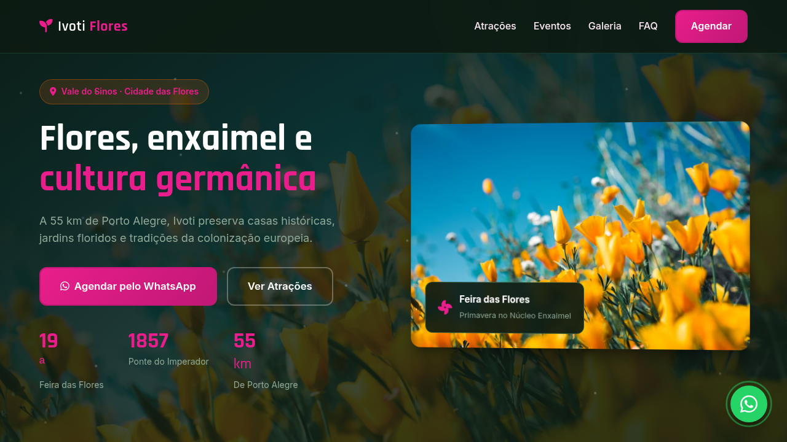
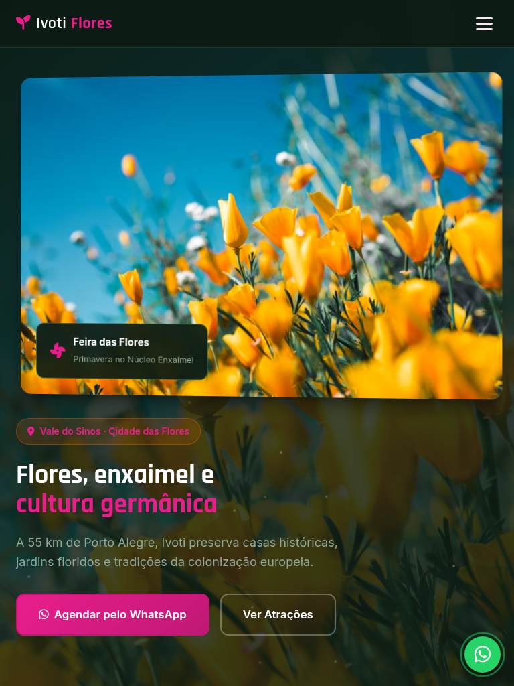
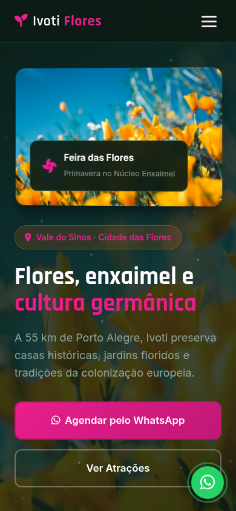

# Ivoti — Landing Page de Turismo

Landing page de alta conversão para turismo em **Ivoti** (Vale do Sinos · Cidade das Flores), com atrações autênticas, eventos locais, galeria visual e agendamento estruturado via WhatsApp.

[](https://tofariasti.github.io/turismo-ivoti/)

## Demo

**Moldura (preview):** [https://tofariasti.github.io/turismo-ivoti/](https://tofariasti.github.io/turismo-ivoti/)

**Tela cheia:** [https://tofariasti.github.io/turismo-ivoti/site/](https://tofariasti.github.io/turismo-ivoti/site/)

## Screenshots

### Desktop (1280px)


### Tablet (768px)


### Mobile (390px)


## Funcionalidades

- Design responsivo mobile-first com identidade visual regional
- Integração WhatsApp com formulário para agendar visita (nome, data, pessoas, roteiro)
- Animações AOS, partículas no hero, contadores e hover nos cards
- Seções: Hero, Como funciona, Atrações, Eventos, Galeria, FAQ e Contato
- Botão flutuante WhatsApp com pulse
- Acessibilidade: skip link, ARIA, contraste, foco visível, alt text
- Respeita `prefers-reduced-motion`
- Moldura iframe com preview desktop/tablet/mobile

## Pontos turísticos destacados

- **Núcleo de Casas Enxaimel** — Casas de madeira entre 1826 e 1950 com Museu Cláudio Oscar Becker.
- **Ponte do Imperador** — Ponte de arenito de 1857 com três arcos — tombada pelo IPHAN.
- **Memorial da Colônia Japonesa** — Acervo da imigração japonesa a partir de 1966 — cultura e gastronomia.
- **Cascata São Miguel** — Queda d'água de ~50 m na divisa com Dois Irmãos — trilha a partir do Núcleo.
- **Pórtico de Ivoti** — Entrada de arenito na BR-116 — boas-vindas à Cidade das Flores.
- **Casa do Artesão** — Artesanato em lã, madeira e produtos coloniais no Núcleo Enxaimel.

## Eventos

- **Feira das Flores** (Out) — Principal evento da primavera com jardinagem, flores e gastronomia colonial.
- **Feira do Mel, Rosca e Nata** (Mai) — Produtos coloniais no Núcleo de Casas Enxaimel.
- **Kolonistenfest** (Jul) — Festa do Colono homenageando imigrantes alemães e japoneses.
- **Kerb in Ivoti** (Jan) — Festa típica alemã com chopp, danças e comidas tradicionais.

## Tecnologias

- HTML5 semântico · CSS3 · JavaScript vanilla
- AOS 2.3.4 · Font Awesome 6.4 · Google Fonts (Rajdhani + Inter)

## Screenshots (geração)

```bash
python3 -m http.server 8765
npm install
npm run screenshots
```

## Repositório

https://github.com/tofariasti/turismo-ivoti

## Autor

**Tiago O. de Farias** — [Farias Digital](https://fariasdigital.com.br/)

---

<p align="center">
  <a href="https://tofariasti.github.io/turismo-ivoti/">🌐 Demo Online</a> ·
  <a href="https://fariasdigital.com.br/">🏢 Site Comercial</a>
</p>
